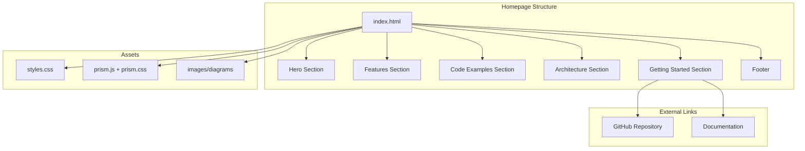

# Product Homepage Design - Product Requirements Document

## Executive Summary

### Problem Statement
MirDB is a feature-rich persistent key-value store with Memcached protocol compatibility, but it currently lacks a dedicated homepage to introduce the product to potential users, developers, and stakeholders. Without an effective web presence, users cannot easily discover MirDB's capabilities, understand its value proposition, or find guidance on getting started.

### Proposed Solution
Create a compelling, informative homepage for MirDB that effectively communicates the product's value proposition, key features, technical architecture, and provides clear pathways for users to get started. The homepage will serve as the primary entry point for developers evaluating MirDB as their key-value storage solution.

### Expected Impact
- **Increased Adoption**: Clear communication of MirDB's unique value proposition (persistence + Memcached compatibility) will attract developers seeking this combination
- **Reduced Onboarding Friction**: Quick-start guides and documentation links will help users get started faster
- **Enhanced Credibility**: Professional web presence establishes trust and positions MirDB as a production-ready solution
- **Community Growth**: Visible contribution pathways will encourage open-source participation

### Success Metrics
- Homepage successfully deployed and accessible
- All key product information clearly presented
- Navigation to documentation and getting started resources functional
- Page loads within acceptable performance thresholds (<3 seconds)

---

## Requirements & Scope

### Functional Requirements

| ID | Requirement | Priority |
|----|-------------|----------|
| REQ-1 | Display product name (MirDB) and tagline prominently in the hero section | Must |
| REQ-2 | Present key value propositions: persistence, Memcached compatibility, LSM-tree architecture | Must |
| REQ-3 | Display core feature highlights with brief descriptions | Must |
| REQ-4 | Provide clear call-to-action buttons (Get Started, Documentation, GitHub) | Must |
| REQ-5 | Include a quick-start code example demonstrating basic usage | Must |
| REQ-6 | Display supported Memcached commands (GET, SET, DELETE, etc.) | Should |
| REQ-7 | Present architecture overview with visual diagram | Should |
| REQ-8 | Include configuration examples showing TOML configuration | Should |
| REQ-9 | Display project status including implemented and planned features | Should |
| REQ-10 | Provide navigation to GitHub repository | Must |
| REQ-11 | Include footer with project links and licensing information | Should |
| REQ-12 | Display default configuration values for quick reference | Could |

### Non-Functional Requirements

| ID | Requirement | Priority |
|----|-------------|----------|
| NFR-1 | Page must be responsive across desktop, tablet, and mobile devices | Must |
| NFR-2 | Page must load within 3 seconds on standard broadband connections | Must |
| NFR-3 | Page must be accessible (WCAG 2.1 AA compliance) | Should |
| NFR-4 | Page must render correctly on modern browsers (Chrome, Firefox, Safari, Edge) | Must |
| NFR-5 | Page must be statically hostable (no server-side rendering required) | Should |
| NFR-6 | Code syntax highlighting for examples must be readable | Must |

### Out of Scope
- User authentication or account management
- Interactive database console or playground
- API documentation (separate documentation site)
- Blog or news section
- Multiple language translations
- Search functionality
- Analytics integration (can be added later)

### Success Criteria
- All "Must" priority requirements implemented and functional
- Homepage passes visual review for professional appearance
- Homepage is deployable as static files
- All links and navigation elements function correctly

---

## User Experience & Interface

### Target User Personas

**Primary: Backend Developer**
- Evaluating key-value stores for their application
- Familiar with Memcached protocol
- Needs persistence that Memcached doesn't provide
- Values clear documentation and quick-start guides

**Secondary: DevOps Engineer**
- Evaluating infrastructure components
- Interested in configuration options and operational characteristics
- Wants to understand deployment requirements

### User Journey

```
Landing → Understand Value Prop → Explore Features → View Code Example → Get Started/GitHub
```

1. **First Impression** (0-5 seconds): Hero section immediately communicates what MirDB is
2. **Value Understanding** (5-30 seconds): Feature section explains key differentiators
3. **Technical Evaluation** (30-120 seconds): Code examples and architecture demonstrate capability
4. **Action** (2+ minutes): User clicks to get started, view docs, or explore GitHub

### Interface Requirements

#### Hero Section
- Product logo/name prominently displayed
- Concise tagline: "Persistent Key-Value Store with Memcached Protocol"
- Brief description (2-3 sentences) explaining the core value
- Primary CTA: "Get Started" button
- Secondary CTA: "View on GitHub" button

#### Features Section
- Grid or card layout highlighting 3-4 key features:
  - Memcached Protocol Compatibility
  - Persistent Storage (SSTables)
  - LSM-Tree Architecture
  - Easy Configuration

#### Code Example Section
- Syntax-highlighted code showing basic operations
- Example connecting with standard memcached client
- Copy-to-clipboard functionality (optional)

#### Architecture Section
- Visual diagram showing data flow (Write → WAL → Memtable → SSTable)
- Brief explanation of LSM-tree benefits

#### Getting Started Section
- Installation command
- Basic configuration example
- Link to full documentation

#### Footer
- GitHub repository link
- License information (if applicable)
- Version/status information

### Accessibility Considerations
- Sufficient color contrast for all text
- Alt text for all images and diagrams
- Keyboard navigable interface
- Semantic HTML structure
- Screen reader compatible

---

## Technical Considerations

### High-Level Technical Approach
The homepage will be implemented as a static website that can be hosted on any static file server (GitHub Pages, Netlify, Vercel, S3, etc.). This approach ensures maximum portability, minimal operational overhead, and fast load times.

### Technology Options
- **Static HTML/CSS/JS**: Maximum simplicity, no build step required
- **Static Site Generator**: (Hugo, Jekyll, Eleventy) - Better for future documentation expansion
- **Modern Frontend Framework**: (React, Vue with static export) - Overkill for single page

### Integration Points
- Links to GitHub repository for source code access
- Links to external documentation (if available)
- Potential future integration with package registries (crates.io)

### Key Technical Constraints
- Must be hostable as static files without server-side processing
- Should minimize external dependencies for reliability
- Must support syntax highlighting for code examples

### Performance Considerations
- Optimize images and assets for fast loading
- Consider lazy loading for below-fold content
- Minimize CSS/JS bundle sizes

---

## Design Specification

### Recommended Approach
Build a single-page static website using modern HTML5, CSS3, and minimal JavaScript. Use a clean, developer-focused design that emphasizes readability and quick information scanning. Host on GitHub Pages for zero operational cost and automatic deployment.

### Key Technical Decisions

#### 1. Implementation Technology
- **Options Considered**: Pure HTML/CSS/JS, Static Site Generator (Hugo/Jekyll), React/Vue SPA
- **Tradeoffs**: Pure HTML is simplest but harder to maintain; SSGs add complexity but better for growth; SPAs are overkill for a single page
- **Recommendation**: Pure HTML/CSS with minimal JS for initial implementation - simplest path that meets all requirements

#### 2. Styling Approach
- **Options Considered**: Custom CSS, Tailwind CSS, Bootstrap, CSS Framework
- **Tradeoffs**: Custom CSS offers full control but takes longer; frameworks speed development but add dependencies
- **Recommendation**: Custom CSS with CSS custom properties (variables) for maintainability - keeps bundle size minimal

#### 3. Code Syntax Highlighting
- **Options Considered**: Prism.js, Highlight.js, Server-side pre-highlighted, No highlighting
- **Tradeoffs**: Client-side libs add weight but are flexible; pre-highlighted is faster but less maintainable
- **Recommendation**: Prism.js - lightweight, well-maintained, and supports Rust/TOML/shell syntax

#### 4. Hosting Platform
- **Options Considered**: GitHub Pages, Netlify, Vercel, Self-hosted
- **Tradeoffs**: GitHub Pages is free and integrated with repo; Netlify/Vercel offer more features; self-hosted adds operational burden
- **Recommendation**: GitHub Pages - free, reliable, automatic deployment from repository

### High-Level Architecture



### Key Considerations
- **Performance**: Static files ensure fast load times; Prism.js loaded asynchronously; images optimized
- **Security**: No server-side code eliminates attack surface; all content is static
- **Scalability**: Static hosting scales infinitely; CDN can be added if traffic grows

### Risk Management
- **Browser Compatibility Risk**: Test across major browsers; use CSS feature detection for progressive enhancement
- **Content Staleness Risk**: Keep documentation links pointing to versioned/stable resources; include "last updated" date

### Success Criteria
- Page loads in under 3 seconds on 3G connection
- All sections render correctly on mobile (320px) through desktop (1920px+)
- Lighthouse performance score above 90
- All interactive elements (buttons, links) function correctly

---

## User Stories

### Personas
- **Backend Developer**: Evaluating MirDB for their application's key-value storage needs
- **DevOps Engineer**: Assessing operational characteristics and deployment requirements

### Core User Stories

#### US-1: Understand Product Value
**As a** Backend Developer
**I want** to quickly understand what MirDB is and its key benefits
**So that** I can determine if it's worth further evaluation

**Priority**: Must

**Acceptance Criteria**:
- Given I land on the homepage
- When the page loads
- Then I see a clear product name, tagline, and value proposition within the first viewport
- And I understand that MirDB is a persistent key-value store with Memcached compatibility

**Traceability**: REQ-1, REQ-2

---

#### US-2: Explore Key Features
**As a** Backend Developer
**I want** to see the main features and capabilities of MirDB
**So that** I can understand how it compares to alternatives

**Priority**: Must

**Acceptance Criteria**:
- Given I am on the homepage
- When I scroll past the hero section
- Then I see clearly presented feature cards/sections
- And each feature has a title and brief description
- And I can identify key differentiators (persistence, Memcached protocol, LSM-tree)

**Traceability**: REQ-3

---

#### US-3: View Code Examples
**As a** Backend Developer
**I want** to see practical code examples of using MirDB
**So that** I can understand how easy it is to integrate

**Priority**: Must

**Acceptance Criteria**:
- Given I am on the homepage
- When I navigate to the code examples section
- Then I see syntax-highlighted code showing basic operations
- And the examples demonstrate connecting and performing GET/SET operations
- And the code is readable and properly formatted

**Traceability**: REQ-5, NFR-6

---

#### US-4: Access Project Resources
**As a** Backend Developer
**I want** to easily navigate to GitHub, documentation, and getting started resources
**So that** I can begin evaluating or using MirDB

**Priority**: Must

**Acceptance Criteria**:
- Given I am on any section of the homepage
- When I look for navigation options
- Then I find clearly visible buttons/links to GitHub repository
- And I find a "Get Started" call-to-action
- And all links open correctly and navigate to valid destinations

**Traceability**: REQ-4, REQ-10

---

#### US-5: View on Mobile Device
**As a** Backend Developer
**I want** to view the homepage on my mobile device
**So that** I can evaluate MirDB while away from my desk

**Priority**: Must

**Acceptance Criteria**:
- Given I access the homepage on a mobile device
- When the page loads
- Then all content is readable without horizontal scrolling
- And navigation elements are tap-friendly (min 44px touch targets)
- And code examples remain readable with horizontal scroll if needed

**Traceability**: NFR-1, NFR-4

---

#### US-6: Understand Architecture
**As a** DevOps Engineer
**I want** to understand MirDB's internal architecture
**So that** I can assess its operational characteristics

**Priority**: Should

**Acceptance Criteria**:
- Given I am on the homepage
- When I navigate to the architecture section
- Then I see a visual diagram showing the data flow
- And I understand the LSM-tree structure (Memtable → SSTable levels)
- And I can identify key components (WAL, compaction)

**Traceability**: REQ-7

---

#### US-7: Review Configuration Options
**As a** DevOps Engineer
**I want** to see configuration examples and default values
**So that** I can understand deployment and tuning options

**Priority**: Should

**Acceptance Criteria**:
- Given I am on the homepage
- When I navigate to the configuration section
- Then I see a TOML configuration example
- And I can identify key configuration parameters
- And default values are visible for reference

**Traceability**: REQ-8, REQ-12

---

## Dependencies & Assumptions

### Dependencies
- GitHub repository must be accessible for "View on GitHub" links
- If separate documentation site exists, it must be available for documentation links

### Assumptions
- The MirDB project will continue active development
- GitHub Pages (or similar) hosting will remain available
- Modern browsers with CSS Grid/Flexbox support are acceptable target (no IE11)

---

## Appendices

### A. Content Requirements

#### Hero Tagline Options
1. "Persistent Key-Value Store with Memcached Protocol"
2. "The Memcached-Compatible Database That Persists Your Data"
3. "Fast, Persistent, Memcached-Compatible"

#### Feature Highlights Content

**Feature 1: Memcached Protocol**
- Title: "Memcached Compatible"
- Description: "Use existing memcached clients and libraries. Drop-in replacement with zero code changes."

**Feature 2: Persistent Storage**
- Title: "Built-in Persistence"
- Description: "Unlike memcached, your data survives restarts. SSTables ensure durability without sacrificing speed."

**Feature 3: LSM-Tree Architecture**
- Title: "LSM-Tree Engine"
- Description: "Write-optimized storage with automatic compaction. Handles high write throughput efficiently."

**Feature 4: Easy Configuration**
- Title: "Simple Configuration"
- Description: "TOML-based configuration with sensible defaults. Get started with minimal setup."

### B. Code Example Content

```bash
# Start MirDB server
mirdb -c /path/to/config.toml

# Connect with any memcached client
telnet localhost 12333

# Store a value
set mykey 0 0 5
hello
STORED

# Retrieve the value
get mykey
VALUE mykey 0 5
hello
END
```

### C. Reference: Default Configuration Values

| Parameter | Default Value |
|-----------|---------------|
| Listen Address | 0.0.0.0:12333 |
| Max LSM Levels | 7 |
| Work Directory | /tmp/mirdb |
| SSTable Max Size | 100MB |
| Memtable Max Size | 4MB |
| Block Size | 4KB |
