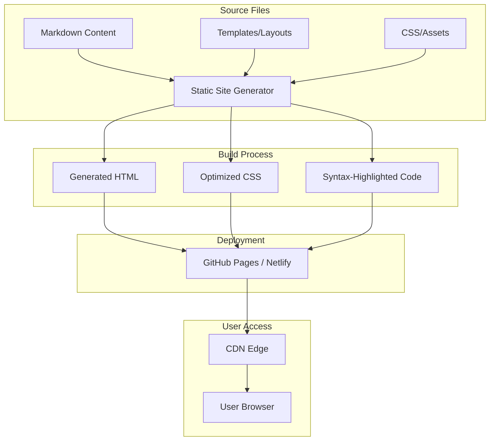

# Product Homepage Design - Product Requirements Document

## Executive Summary

### Problem Statement
MirDB is a powerful persistent key-value store with memcached protocol compatibility, but currently lacks a web presence to communicate its value proposition, features, and usage instructions to potential users. Without a homepage, developers cannot easily discover, evaluate, or adopt MirDB for their projects.

### Proposed Solution
Create a product homepage that effectively communicates MirDB's unique capabilities, provides clear getting-started guidance, and establishes credibility as a production-ready database solution. The homepage will serve as the primary marketing and documentation entry point for the project.

### Expected Impact
- **Increased Adoption**: Clear value proposition and quick-start guides lower the barrier to trying MirDB
- **Reduced Support Burden**: Self-service documentation answers common questions
- **Project Credibility**: Professional web presence signals project maturity and active maintenance
- **Community Growth**: Visible project information enables contribution and community building

### Success Metrics
- Homepage successfully deployed and accessible
- All core product features clearly documented
- Getting-started guide enables new users to run MirDB within 5 minutes
- Page loads in under 3 seconds on standard connections

---

## Requirements & Scope

### Functional Requirements

| ID | Requirement | Priority |
|----|-------------|----------|
| REQ-1 | Display product name, tagline, and value proposition prominently | Must |
| REQ-2 | Showcase key features: Memcached compatibility, persistence, LSM-tree architecture | Must |
| REQ-3 | Provide installation/quick-start instructions with code examples | Must |
| REQ-4 | Display supported commands (GET, SET, DELETE, etc.) with usage examples | Must |
| REQ-5 | Show configuration options and example TOML configuration | Should |
| REQ-6 | Include comparison with memcached highlighting MirDB's advantages | Should |
| REQ-7 | Link to source repository (GitHub) | Must |
| REQ-8 | Display project status and roadmap (e.g., planned Raft consensus) | Could |
| REQ-9 | Provide contact/contribution information | Should |
| REQ-10 | Include architecture diagram showing LSM-tree data flow | Could |

### Non-Functional Requirements

| ID | Requirement | Priority |
|----|-------------|----------|
| NFR-1 | Page must be responsive and display correctly on mobile, tablet, and desktop | Must |
| NFR-2 | Page must load within 3 seconds on 3G connections | Must |
| NFR-3 | Content must be accessible (WCAG 2.1 AA compliance) | Should |
| NFR-4 | Page must function without JavaScript for core content | Should |
| NFR-5 | Static site generation for easy hosting (GitHub Pages, Netlify, etc.) | Must |
| NFR-6 | Code examples must have syntax highlighting | Should |
| NFR-7 | Page must be SEO-optimized with proper meta tags | Should |

### Out of Scope

- User authentication or login functionality
- Interactive database console or playground
- Full API documentation (separate docs site)
- Localization/internationalization (English only for initial release)
- Blog or news section
- Analytics dashboard for usage metrics

### Success Criteria

- [ ] Homepage renders correctly on Chrome, Firefox, Safari, and Edge
- [ ] All feature sections accurately reflect current MirDB capabilities
- [ ] Quick-start code examples are copy-paste functional
- [ ] Page passes Lighthouse performance score of 90+
- [ ] Page passes Lighthouse accessibility score of 90+

---

## User Experience & Interface

### Target Users

1. **Backend Developers**: Evaluating key-value stores for their applications
2. **DevOps Engineers**: Looking for persistent caching solutions
3. **Current Memcached Users**: Seeking persistence without protocol changes
4. **Open Source Contributors**: Interested in contributing to the project

### User Journey

```
Landing → Understand Value Prop → Explore Features → Quick Start → Install/Try → Contribute/Star
```

1. **Landing**: User arrives at homepage (from search, GitHub, or referral)
2. **Value Recognition**: Within 5 seconds, understands what MirDB is and why it matters
3. **Feature Exploration**: Scrolls to learn about specific capabilities
4. **Quick Start**: Finds installation commands and basic usage
5. **Action**: Installs MirDB, stars repository, or bookmarks for later

### Page Structure

| Section | Purpose | Key Content |
|---------|---------|-------------|
| Hero | Immediate value communication | Tagline, 1-line description, CTA buttons |
| Features | Capability showcase | 3-4 feature cards with icons |
| Quick Start | Enable first use | Install command, basic SET/GET example |
| Commands | Reference information | Command table with examples |
| Configuration | Advanced setup | Example TOML, parameter table |
| Footer | Navigation & links | GitHub, license, contribution links |

### Interface Requirements

- Clean, minimal design focusing on content readability
- Dark code blocks with syntax highlighting for examples
- Sticky navigation for easy section access
- Copy-to-clipboard buttons on all code snippets
- Responsive typography scaling for different screen sizes

### Accessibility Considerations

- Semantic HTML structure (proper heading hierarchy)
- Sufficient color contrast (4.5:1 minimum)
- Keyboard navigation support
- Alt text for all images/diagrams
- Focus indicators for interactive elements

---

## User Stories

### Personas

1. **Alex (Backend Developer)**: Building a new service that needs fast key-value storage with durability
2. **Sam (DevOps Engineer)**: Managing infrastructure and evaluating caching solutions
3. **Jordan (Open Source Contributor)**: Looking for interesting Rust projects to contribute to

### Core User Stories

#### Story 1: Understand Product Value
**As a** backend developer evaluating storage solutions,
**I want to** quickly understand what MirDB offers,
**So that** I can decide if it's worth exploring further.

**Acceptance Criteria:**
- Given I land on the homepage
- When the page loads
- Then I see the product name, tagline, and value proposition within the viewport
- And I understand MirDB is a persistent key-value store with memcached compatibility

**Priority:** Must
**Traceability:** REQ-1, REQ-2

#### Story 2: Quick Installation
**As a** developer who wants to try MirDB,
**I want to** find installation instructions immediately,
**So that** I can get it running on my machine quickly.

**Acceptance Criteria:**
- Given I am on the homepage
- When I look for installation instructions
- Then I find a clearly labeled Quick Start section
- And the section contains copy-paste ready commands
- And following the instructions results in a running MirDB instance

**Priority:** Must
**Traceability:** REQ-3

#### Story 3: Learn Basic Commands
**As a** developer new to MirDB,
**I want to** see example commands for basic operations,
**So that** I can start storing and retrieving data.

**Acceptance Criteria:**
- Given I have MirDB running
- When I look for command examples on the homepage
- Then I find examples for SET, GET, and DELETE operations
- And the examples include the expected response format

**Priority:** Must
**Traceability:** REQ-4

#### Story 4: Compare with Memcached
**As a** team lead evaluating whether to switch from memcached,
**I want to** understand the differences between MirDB and memcached,
**So that** I can make an informed decision.

**Acceptance Criteria:**
- Given I am evaluating MirDB
- When I look for comparison information
- Then I find a section explaining how MirDB differs from memcached
- And the key advantage (persistence) is clearly highlighted

**Priority:** Should
**Traceability:** REQ-6

#### Story 5: Access Source Code
**As a** developer or potential contributor,
**I want to** easily navigate to the source repository,
**So that** I can review the code or contribute.

**Acceptance Criteria:**
- Given I am on any section of the homepage
- When I look for the source code link
- Then I find a visible link to the GitHub repository
- And clicking it opens the repository in a new tab

**Priority:** Must
**Traceability:** REQ-7, REQ-9

#### Story 6: View on Mobile
**As a** developer researching on my phone,
**I want to** view the homepage on my mobile device,
**So that** I can evaluate MirDB while commuting.

**Acceptance Criteria:**
- Given I open the homepage on a mobile device
- When the page loads
- Then all content is readable without horizontal scrolling
- And navigation is accessible via a mobile-friendly menu
- And code examples are scrollable within their containers

**Priority:** Must
**Traceability:** NFR-1

---

## Technical Considerations

### High-Level Approach

The homepage will be built as a static site to ensure fast loading, easy hosting, and minimal maintenance overhead. This aligns with MirDB's infrastructure-focused audience who value performance and simplicity.

### Technology Constraints

- **Static Generation**: Required for GitHub Pages/Netlify hosting compatibility (NFR-5)
- **No Backend**: Homepage is purely informational; no server-side processing needed
- **Rust Ecosystem Alignment**: Consider tools familiar to Rust developers (mdBook, Zola) if possible

### Integration Points

- GitHub repository for source links and contribution information
- Potential future integration with documentation site
- Cargo/crates.io for installation instructions (if published)

### Key Technical Requirements

- Syntax highlighting for Rust, TOML, and shell code blocks
- SVG or optimized images for architecture diagrams
- Responsive CSS grid/flexbox layout
- Minimal external dependencies to reduce load time

---

## Design Specification

### Recommended Approach

Build a single-page static website using a modern static site generator, with semantic HTML, minimal CSS, and optional JavaScript enhancement for interactive features like copy-to-clipboard.

### Key Technical Decisions

#### 1. Static Site Generator

- **Options Considered**: Raw HTML/CSS, Hugo, Zola, Jekyll, Eleventy, mdBook
- **Tradeoffs**:
  - Raw HTML: Maximum control but manual maintenance
  - Hugo/Zola: Fast, Rust-friendly, great for content sites
  - Jekyll: GitHub Pages native but Ruby-based
  - mdBook: Rust-native but documentation-focused layout
- **Recommendation**: Zola or Hugo for Rust ecosystem familiarity and excellent performance

#### 2. Styling Approach

- **Options Considered**: Custom CSS, Tailwind CSS, Bootstrap, Pico CSS
- **Tradeoffs**:
  - Custom CSS: Full control, smaller bundle if minimal
  - Tailwind: Utility-first, larger bundle but fast development
  - Bootstrap: Feature-rich but heavy
  - Pico CSS: Minimal, semantic, classless option
- **Recommendation**: Custom CSS or Pico CSS to minimize bundle size and align with simplicity ethos

#### 3. Code Syntax Highlighting

- **Options Considered**: Prism.js, Highlight.js, Built-in SSG highlighting
- **Tradeoffs**:
  - Client-side JS: Additional download, slight delay
  - Built-in SSG: Pre-rendered HTML, zero JS, faster load
- **Recommendation**: Built-in SSG syntax highlighting (Zola/Hugo both support this) for zero JS overhead

#### 4. Hosting Platform

- **Options Considered**: GitHub Pages, Netlify, Vercel, Cloudflare Pages
- **Tradeoffs**:
  - GitHub Pages: Free, close to repo, limited build options
  - Netlify/Vercel: More features, free tier, better CI/CD
  - Cloudflare Pages: Excellent performance, free tier
- **Recommendation**: GitHub Pages for simplicity, with Netlify as alternative if advanced features needed

### High-Level Architecture



### Key Considerations

- **Performance**: Static HTML with inlined critical CSS ensures sub-second first contentful paint; total bundle should be under 100KB
- **Security**: Static sites have minimal attack surface; no server-side code, no database connections, no user input processing
- **Scalability**: CDN distribution handles any traffic level; no scaling concerns for static assets

### Risk Management

- **Content Accuracy Risk**: Homepage content may become outdated as MirDB evolves. Mitigation: Establish review process for homepage updates alongside feature releases.
- **Browser Compatibility Risk**: CSS/JS may behave differently across browsers. Mitigation: Test on major browsers before deployment; use progressive enhancement.

### Success Criteria

- Homepage builds successfully with chosen static site generator
- All code examples render with proper syntax highlighting
- Page achieves Lighthouse performance score of 90+
- Deployment to hosting platform completes without errors

---

## Dependencies & Assumptions

### Dependencies

| Dependency | Type | Impact |
|------------|------|--------|
| GitHub repository access | External | Required for source links and hosting |
| Static site generator (Zola/Hugo) | Tooling | Required for build process |
| CDN/Hosting provider | Infrastructure | Required for serving the site |

### Assumptions

- MirDB source code will remain publicly accessible on GitHub
- Project maintainers will review and approve homepage content
- English is sufficient for initial release (no i18n required)
- Current feature set accurately represents production capabilities

### Cross-Team Coordination

- Content review by MirDB core maintainers for technical accuracy
- Design review if organizational design guidelines exist

---

## Appendices

### A. Key Messages to Communicate

1. **Primary Value Proposition**: "Persistent key-value storage with memcached protocol compatibility"
2. **Differentiator**: "Unlike memcached, your data survives restarts"
3. **Technical Excellence**: "Built with Rust for safety and performance"
4. **Ease of Migration**: "Drop-in replacement for memcached clients"

### B. Example Content Snippets

**Tagline Options:**
- "Memcached, but persistent."
- "The key-value store that remembers."
- "Fast caching. Durable storage. Familiar protocol."

**Quick Start Example:**
```bash
# Install and run MirDB
cargo install mirdb
mirdb -c mirdb.toml

# Connect with any memcached client
$ telnet localhost 12333
set mykey 0 0 5
hello
STORED
get mykey
VALUE mykey 0 5
hello
END
```

### C. Reference Configuration

```toml
addr = "0.0.0.0:12333"
max_level = 7
work_dir = "/tmp/mirdb"
sst_max_size = "100M"
mem_table_max_size = "4M"
```

### D. Requirement Traceability Matrix

| Requirement | User Story | Design Section |
|-------------|------------|----------------|
| REQ-1 | Story 1 | Hero Section |
| REQ-2 | Story 1 | Features Section |
| REQ-3 | Story 2 | Quick Start Section |
| REQ-4 | Story 3 | Commands Section |
| REQ-5 | - | Configuration Section |
| REQ-6 | Story 4 | Features/Comparison |
| REQ-7 | Story 5 | Header/Footer |
| NFR-1 | Story 6 | Responsive CSS |
| NFR-5 | - | SSG Architecture |
