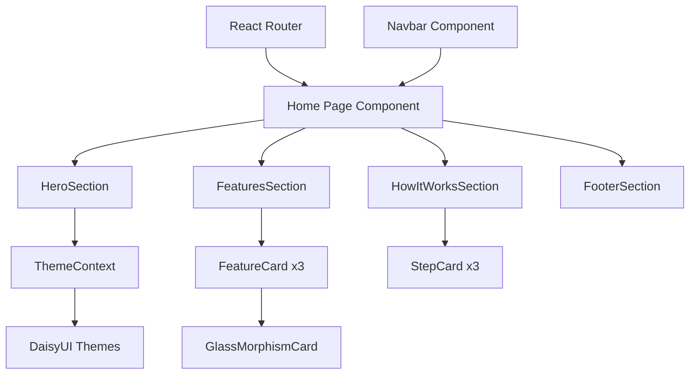

# Product Homepage Design - Product Requirements Document

## Executive Summary

### Problem Statement
The URL Shortening Service currently lacks a compelling, user-friendly homepage that effectively communicates the product's value proposition and converts visitors into registered users. New visitors landing on the application need a clear understanding of what the service offers, its key benefits, and a frictionless path to getting started.

### Proposed Solution
Design and implement an engaging, modern homepage that showcases the URL shortening service's core capabilities, highlights key features like analytics and link management, and provides clear calls-to-action for user registration and login. The homepage will leverage the existing Tailwind CSS + DaisyUI design system to ensure visual consistency with the rest of the application.

### Expected Impact
- **Business Value**: Increased user registration conversion rates through clear value communication
- **User Benefits**: Better understanding of product capabilities before committing to registration
- **Brand Positioning**: Professional, modern appearance that builds trust with potential users

### Success Metrics
- User engagement: Time spent on homepage before navigation
- Conversion rate: Percentage of homepage visitors who proceed to register
- Bounce rate: Reduction in users who leave without exploring further
- Feature discovery: Click-through rates on feature highlights

---

## Requirements & Scope

### Functional Requirements

| ID | Requirement | Priority |
|----|-------------|----------|
| REQ-1 | Display a hero section with a compelling headline that communicates the core value proposition of the URL shortening service | Must Have |
| REQ-2 | Include a prominent call-to-action (CTA) button directing users to the registration page | Must Have |
| REQ-3 | Display a secondary CTA for existing users to log in | Must Have |
| REQ-4 | Showcase key features of the service (URL shortening, analytics, link management) in a visually appealing features section | Must Have |
| REQ-5 | Display brief explanations of how the service works (create, share, track workflow) | Should Have |
| REQ-6 | Include visual elements (icons, illustrations, or animations) that reinforce the product's modern, tech-forward brand | Should Have |
| REQ-7 | Provide a demo or preview section showing sample shortened URLs and analytics visualizations | Could Have |
| REQ-8 | Display social proof elements such as usage statistics or testimonials | Could Have |
| REQ-9 | Include a footer with navigation links, legal information, and contact details | Should Have |

### Non-Functional Requirements

| ID | Requirement | Priority |
|----|-------------|----------|
| NFR-1 | Homepage must load within 3 seconds on a standard broadband connection | Must Have |
| NFR-2 | Design must be fully responsive across mobile, tablet, and desktop viewports | Must Have |
| NFR-3 | Must support all existing theme options (light, dark, cyberpunk, synthwave, etc.) | Must Have |
| NFR-4 | All interactive elements must be keyboard accessible | Should Have |
| NFR-5 | Color contrast must meet WCAG 2.1 AA accessibility standards | Should Have |
| NFR-6 | Animations must respect user's reduced motion preferences | Should Have |
| NFR-7 | Page must be SEO-optimized with appropriate meta tags and semantic HTML | Should Have |

### Out of Scope
- Backend API changes or new endpoints
- User authentication flow modifications
- Pricing page or premium tier promotion
- Blog or content management features
- Internationalization/localization
- A/B testing infrastructure

### Success Criteria
- Homepage renders correctly across Chrome, Firefox, Safari, and Edge browsers
- All CTAs link to appropriate destinations (register, login)
- Page achieves Lighthouse performance score of 80+
- No visual regressions in existing theme support
- Mobile responsiveness verified on iOS and Android devices

---

## User Experience & Interface

### User Journey

1. **Arrival**: User lands on homepage from search engine, direct link, or referral
2. **Discovery**: User sees hero section with value proposition
3. **Interest**: User scrolls to explore features and how-it-works sections
4. **Decision**: User decides to try the service
5. **Action**: User clicks CTA to register or log in
6. **Conversion**: User completes registration and accesses dashboard

### Interface Requirements

#### Hero Section
- Full-width hero area with gradient or animated background
- Large, bold headline (e.g., "Shorten, Share, Track")
- Subheadline explaining the service in one sentence
- Primary CTA button: "Get Started Free"
- Secondary CTA link: "Already have an account? Log in"

#### Features Section
- Three-column grid layout (responsive to single column on mobile)
- Feature cards with icons for:
  - **URL Shortening**: Create memorable, short links instantly
  - **Analytics Dashboard**: Track clicks, locations, and referrers
  - **Link Management**: Organize and manage all your links
- Each card includes icon, title, and brief description

#### How It Works Section
- Step-by-step visual guide:
  1. Paste your long URL
  2. Get your shortened link
  3. Share and track performance
- Simple illustrations or icons for each step

#### Footer
- Navigation links: Home, Login, Register
- Legal links: Privacy Policy, Terms of Service
- Copyright notice

### Accessibility Considerations
- All images include descriptive alt text
- Interactive elements have visible focus states
- Color is not the sole means of conveying information
- Text is scalable without loss of functionality
- Screen reader compatibility for all content

### User Interaction Patterns
- Smooth scroll animations between sections
- Hover effects on CTA buttons and feature cards
- Subtle entrance animations as sections come into view
- Theme toggle accessibility in navigation

---

## Technical Considerations

### High-Level Technical Approach
The homepage will be implemented as a React component within the existing frontend architecture, utilizing the established Tailwind CSS + DaisyUI styling system and Framer Motion for animations. The component will be stateless and render purely from props/constants, requiring no backend integration.

### Integration Points with Existing Systems
- **Routing**: Integrate with existing React Router configuration (public route at `/`)
- **Theme System**: Utilize ThemeContext and Zustand store for theme support
- **Component Library**: Leverage existing DaisyUI components and custom components (FuturisticButton, GlassMorphismCard)
- **Navigation**: Integrate with existing Navbar component

### Key Technical Constraints
- Must use existing React 18 + TypeScript setup
- Must conform to current Tailwind CSS configuration
- Must work with Vite build system
- No additional dependencies unless strongly justified

### Performance and Scalability Considerations
- Lazy load below-the-fold images
- Optimize hero background assets
- Use CSS animations where possible over JavaScript
- Minimize Framer Motion usage to essential interactions

---

## Design Specification

### Recommended Approach
Build the homepage as a single React component that composes existing UI components (buttons, cards, navigation) while adding new homepage-specific sections. Leverage the existing design system tokens and DaisyUI theme support to ensure visual consistency.

### Key Technical Decisions

#### 1. Component Architecture
- **Options Considered**: Single monolithic component vs. Modular section components
- **Tradeoffs**: Monolithic is simpler but harder to maintain; modular enables reuse and testing but adds complexity
- **Recommendation**: Modular approach with HeroSection, FeaturesSection, HowItWorksSection, and FooterSection components for maintainability

#### 2. Animation Strategy
- **Options Considered**: Pure CSS animations vs. Framer Motion vs. No animations
- **Tradeoffs**: CSS is lightweight but limited; Framer Motion is powerful but adds bundle size; no animations feels static
- **Recommendation**: CSS for hover states, Framer Motion only for scroll-triggered entrance animations to balance performance and engagement

#### 3. Image/Asset Handling
- **Options Considered**: Static images vs. SVG illustrations vs. CSS-only graphics
- **Tradeoffs**: Images require loading; SVGs scale but need creation; CSS is fast but limited
- **Recommendation**: SVG icons from existing icon library plus CSS gradients for backgrounds to minimize asset loading

#### 4. Responsive Strategy
- **Options Considered**: Mobile-first vs. Desktop-first development
- **Tradeoffs**: Mobile-first ensures mobile quality; desktop-first may neglect mobile
- **Recommendation**: Mobile-first using Tailwind's responsive utilities, consistent with existing codebase patterns

### High-Level Architecture

### Key Considerations
- **Performance**: Lazy loading below-fold content and optimizing hero assets will keep LCP under 2.5s
- **Security**: No user input on homepage; no security concerns beyond standard XSS prevention in React
- **Scalability**: Static content scales infinitely; no backend calls required

### Risk Management
- **Browser Compatibility Risk**: DaisyUI/Tailwind may have edge cases in older browsers; mitigate with thorough cross-browser testing before release
- **Theme Integration Risk**: Complex background effects may not render consistently across all themes; mitigate by testing each theme during development

### Success Criteria
- Homepage renders correctly on all supported browsers
- All themes display consistently without visual artifacts
- Lighthouse performance score of 80+
- Component tests pass for all homepage sections

---

## Dependencies & Assumptions

### External Dependencies
- **DaisyUI**: Requires version compatibility with existing installation
- **Framer Motion**: Already installed in project; no new dependency required
- **React Router**: Existing routing infrastructure

### Assumptions
- The existing Home.tsx component can be replaced or significantly refactored
- Design assets (icons, illustrations) will be sourced from existing libraries or created as SVGs
- No A/B testing is required for initial launch
- Registration functionality will remain enabled (controlled by admin settings)

### Cross-Team Coordination
- None required; this is a frontend-only change within existing architecture
