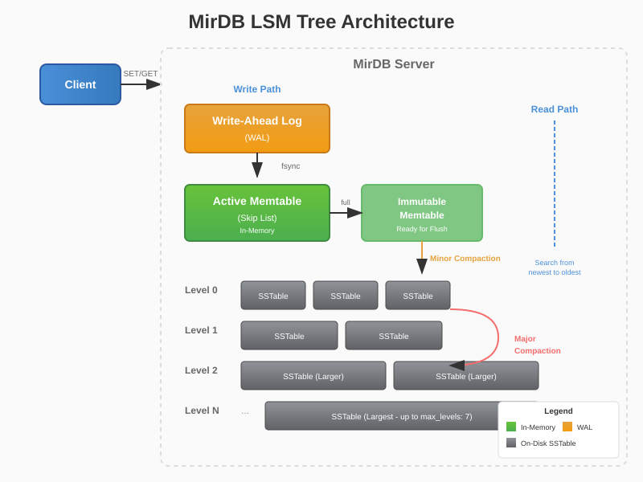

# Architecture Overview

MirDB implements an LSM Tree (Log-Structured Merge Tree) architecture, a design pattern optimized for write-heavy workloads while maintaining efficient read performance. This page explains the core components that make MirDB a reliable and performant persistent key-value store.

<section id="architecture-overview" class="architecture-section">

## How MirDB Works

<div class="architecture-diagram-container">
  
</div>

The diagram above illustrates the data flow in MirDB. When a write operation arrives, it follows a carefully designed path that balances performance with durability.

</section>

<section id="memtables" class="architecture-component">

## Memtables

A **memtable** is an in-memory data structure that serves as the first destination for all write operations. When you issue a `set` command to MirDB, the key-value pair is immediately written to the active memtable.

Key characteristics of memtables in MirDB:

- **Fast writes**: All writes go directly to memory, providing sub-millisecond latency
- **Sorted storage**: Keys are maintained in sorted order for efficient range queries
- **Size-limited**: When a memtable reaches `memtable_max_size` (default 4MB), it becomes immutable and a new active memtable is created
- **Flushing**: Immutable memtables are asynchronously flushed to disk as SSTables

The memtable acts as a write buffer, batching multiple operations before persisting them to disk. This amortizes the cost of disk I/O across many operations.

</section>

<section id="skip-lists" class="architecture-component">

## Skip Lists

MirDB implements memtables using a **skip list** data structure. A skip list is a probabilistic data structure that provides O(log n) search, insert, and delete operations.

Why skip lists?

- **Lock-free reads**: Multiple readers can traverse the skip list concurrently without blocking
- **Simple implementation**: Compared to balanced trees, skip lists are easier to implement correctly
- **Cache-friendly**: Sequential memory access patterns improve CPU cache utilization
- **Probabilistic balancing**: No complex rebalancing operations required during insertions

The skip list maintains multiple levels of linked lists. The bottom level contains all elements, while higher levels contain a subset of elements, creating "express lanes" for faster traversal.

```
Level 3: ─────────────────────────────────────────▶ [M]
Level 2: ─────────▶ [D] ─────────────▶ [K] ──────▶ [M]
Level 1: ──▶ [B] ──▶ [D] ──▶ [G] ──▶ [K] ──▶ [L] ▶ [M]
Level 0: [A]─[B]─[C]─[D]─[E]─[F]─[G]─[H]─[I]─[J]─[K]─[L]─[M]
```

</section>

<section id="sstables" class="architecture-component">

## SSTables

**Sorted String Tables (SSTables)** are immutable, on-disk files that store key-value pairs in sorted order. When a memtable is flushed, it becomes an SSTable.

SSTable structure in MirDB:

- **Data blocks**: Key-value pairs grouped into 4KB blocks (configurable via `block_size`)
- **Index block**: Sparse index pointing to data block locations
- **Bloom filter**: Probabilistic structure for quick key existence checks
- **Maximum size**: Configurable via `sstable_max_size` (default 100MB)

Benefits of SSTables:

- **Immutability**: Once written, SSTables never change, simplifying concurrency
- **Sequential writes**: Data is written sequentially, maximizing disk throughput
- **Efficient reads**: Sorted order enables binary search within blocks
- **Compression-friendly**: Sorted, immutable data compresses well

</section>

<section id="wal" class="architecture-component">

## Write-Ahead Log (WAL)

The **Write-Ahead Log (WAL)** is MirDB's durability mechanism. Before any write is acknowledged to the client, it is first persisted to the WAL.

WAL characteristics:

- **Sequential writes**: All operations are appended to a single file
- **Durability guarantee**: Data in WAL survives process crashes
- **Recovery**: On startup, MirDB replays the WAL to restore memtable state
- **Truncation**: WAL entries are removed after corresponding memtable flushes

The WAL follows a simple principle: "write first, then execute." This ensures that no acknowledged write is ever lost, even in the event of sudden power loss or system crashes.

```
1. Client sends SET key value
2. MirDB appends operation to WAL
3. WAL write synced to disk (fsync)
4. Operation applied to memtable
5. Success returned to client
```

</section>

<section id="compaction" class="architecture-component">

## Compaction

**Compaction** is the background process that merges and reorganizes SSTables to maintain read performance and reclaim space from deleted or overwritten keys.

MirDB supports two types of compaction:

### Minor Compaction

Minor compaction flushes an immutable memtable to a new SSTable at Level 0 of the LSM tree. This process:

- Creates a new SSTable from memtable contents
- Adds the SSTable to Level 0
- Clears the immutable memtable from memory
- Truncates corresponding WAL entries

### Major Compaction

Major compaction merges multiple SSTables across levels to reduce read amplification and reclaim space:

- **Leveled structure**: MirDB organizes SSTables into levels (up to `max_levels`, default 7)
- **Size ratios**: Each level can hold ~10x more data than the previous
- **Merge process**: Overlapping SSTables are merged, keeping only the latest version of each key
- **Deletion handling**: Tombstones (deletion markers) are propagated or removed

Compaction is crucial for long-term performance:

- **Read performance**: Fewer SSTables to search means faster reads
- **Space reclamation**: Old versions and deleted keys are removed
- **Write amplification tradeoff**: Rewriting data multiple times vs. query efficiency

</section>
